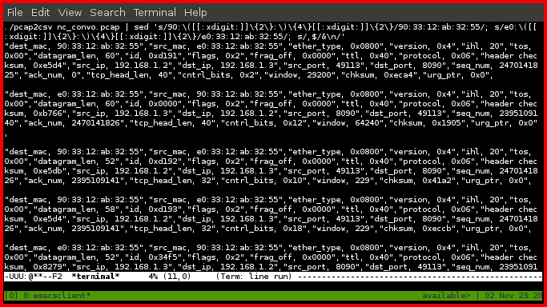

# pcap2csv

A c program that reads pcap files generated by tcpdump and writes each packet's
fields to stdout in csv format.  By converting the binary pcap data to string
data, I can take advantage of unix scripting tools for strings.

# examples

A session where I take the csv output and pipe it to sed.  Sed proceeds to hide
my mac addresses and adds a new line between packets in order to make the output
(relatively) easier to read.

# installation instructions

    make pcap2csv

# status

-   So far the program only recognizes packets that are rfc compliant and only
    up to the tcp layer.
